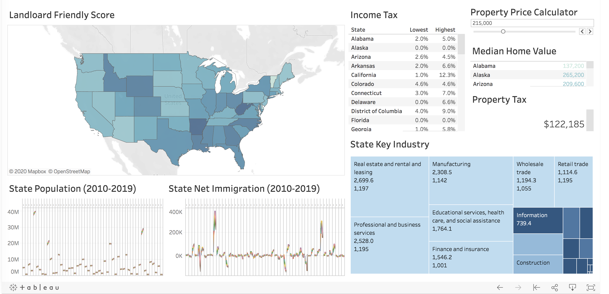
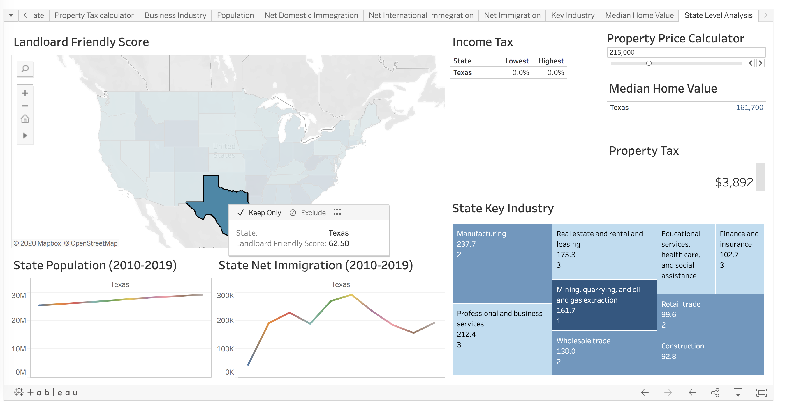

# Real Estate Investment Analysis

I'd like to share some real estate investment insights in the U.S from a data scientist perspective.

If you want to invest in an out-of-state house or you are trying to choose the best house 
for your investment with reference to multiple dimensions，please check this out!

# State
The first thing to consider is which state you plan to invest in.
I offer the following perspective on this matter.

- Landlord friendly score
  - From tenant-landlord laws to taxes and insurance rates, landlords in each and every state are expected to abide by countless rules and regulations. 
  - Eviction Process, Landlord & Tenant Rights, Rent Control, Registration & Licenses, Tax & Insurance Rates, Competition
- State property tax
- State income tax
  - This is critical if you want to work in this state
- Population & Migration trend
  - Observing a state's growth from the perspective of demographic change
- Key industry
  - Top 10 industries in every state， ranked by each industry's contribution to the GDP. 

Let's take Texas as an example.

[Next consider city level, county level and zipcode level...]

[To be continued...]

Reference:
- https://www.fortunebuilders.com/landlord-friendly-states/
- https://www.census.gov/data/tables/time-series/demo/popest/2010s-state-total.html
- https://www.census.gov/data/datasets/2018/econ/cbp/2018-cbp.html
